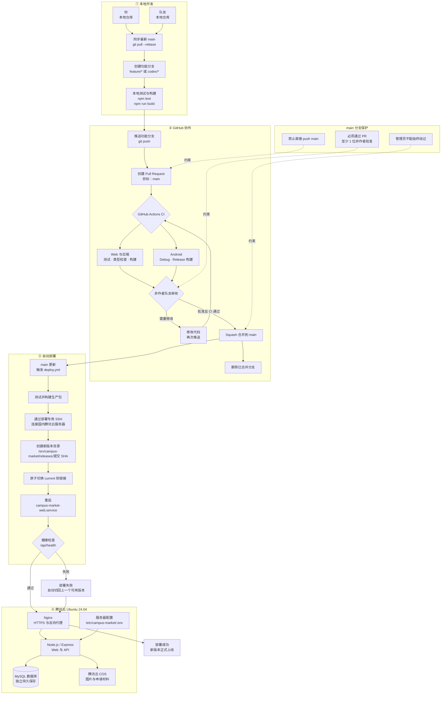

# 校园闲鱼（campus-trade）

## 开发、审核与自动部署工作流

你和队友都通过功能分支与 Pull Request 协作，不能直接推送受保护的 `main`。合并后由 GitHub Actions 自动部署；数据库、服务器环境变量和 COS 文件不会被代码发布覆盖。



## 多学校与多校区

Web 与后端支持多个学校、每所学校多个校区。账号和商品分别保存 `school_id` 与 `campus_id`：学校由受支持的校园邮箱域名确定，普通用户不能在个人资料中修改；校区可在同一学校内随时切换。商品保存发布时的学校/校区快照，切换个人校区不会移动历史商品。

学校目录保存在数据库的 `schools`、`campuses`、`school_email_domains` 表中，并由管理后台维护；`SCHOOL_CATALOG_JSON` 只在首次初始化空数据库时作为种子。客户端不能自行提交任意学校。已有 `ruc_suzhou` 会幂等迁移为 `school_id=ruc`、`campus_id=suzhou`。

`2025202211@ruc.edu.cn` 是唯一平台总管理员，可查看全部学校并指定学校负责人。其他管理员只能查看和管理自己学校的数据。商品固定归属于发布时的学校与校区，其他校区无法查看；商品主人可在自己的主页和“我的发布”中按校区查看全部历史商品。本次改造只覆盖数据库、后端和 Web，iOS/Android 暂未同步。

面向校内用户的多端二手闲置交易平台。仓库包含 React Web、SwiftUI iOS、Jetpack Compose Android、Node.js API、MySQL 数据层，以及搜索、推荐、钱包和自动部署能力。

- 线上地址：<https://20250821cdcdifc.top/campus-trade/>
- 健康检查：<https://20250821cdcdifc.top/campus-trade/api/health>
- API 文档：[`docs/api.md`](docs/api.md)
- 架构与运维文档：[`docs/README.md`](docs/README.md)

## 仓库结构

| 目录 | 说明 | 状态 |
| --- | --- | --- |
| `frontend/` | React 19 + Vite 7 Web 客户端，含移动端布局和管理后台 | ✅ 已实现 |
| `app-ios/` | SwiftUI 原生客户端，支持 iOS 17+ | ✅ 已实现 |
| `app-android/` | Kotlin + Jetpack Compose 原生客户端，minSdk 26 / targetSdk 35 | ✅ 已实现 |
| `backend/` | Express 5 API、MySQL 数据层、后台任务、部署脚本 | ✅ 已实现 |
| `docs/` | API、架构、搜索、推荐、配置、部署与运维文档 | ✅ 持续维护 |

## 已实现能力

- 邮箱验证码注册、登录、找回/修改密码和 Cookie 会话
- 校内身份边界、用户资料、头像、邮件通知和管理后台
- 商品发布/编辑、图片上传、分类筛选、收藏、评论、举报和站内聊天
- 关键词归一化、校园别名、型号精确匹配、分页与离线搜索评测
- 可选本地 Embedding、混合检索、行为事件、灰度推荐与指标分析
- Android 商品分页、聊天轮询、Keystore 会话加密和只读奖励钱包
- 原石 / 创世结晶双币种钱包：注册、发布、购买自动奖励，管理员可配置与手动发放
- 自营账号体系：仅自营账号可发布原石计价商品，支持人民币 + 原石双价格展示
- 在线担保交易：原石购买「确认收货后到账」，支持取消退款与购买奖励
- 商品 / 贴图发布性质、苏州区 / 北京区区域筛选、猫彩蛋跳转与头像旁成就系统
- GitHub Actions PR 校验、受保护分支合并和服务器原子发布/回滚

详细边界和降级顺序见 [`docs/architecture.md`](docs/architecture.md)、[`docs/search.md`](docs/search.md) 和 [`docs/recommendation.md`](docs/recommendation.md)。

## 本地开发

### Web 与后端

要求 Node.js 22+ 与 MySQL 8.0+：

```bash
cp .env.example .env
npm ci
npm run dev
```

默认 Web 地址为 `http://localhost:5173`，API 地址为 `http://localhost:8787`。`.env` 需要填写 MySQL；SMTP、腾讯云 COS、Embedding 和推荐均可按文档选择配置。

常用检查：

```bash
npm test
npm run typecheck
npm run build
```

### Android

要求 JDK 17 与 Android SDK 35：

```bash
cd app-android
./gradlew assembleDebug
```

Debug 默认通过模拟器地址 `http://10.0.2.2:8787/` 连接本地 API；Release 固定连接生产 HTTPS 地址。完整说明见 [`app-android/README.md`](app-android/README.md)。

### iOS

使用 Xcode 打开 `app-ios/CampusMarket.xcodeproj`，选择 `CampusMarket` scheme 和 iPhone 模拟器运行。首次真机构建需要配置开发团队，详见 [`app-ios/README.md`](app-ios/README.md)。

## 搜索、推荐与钱包工具

```bash
npm run search:evaluate
npm run search:evaluate-hybrid
npm run recommendation:evaluate
npm run embeddings:rebuild
npm run grant -- <邮箱> <币种> <数量> <原因>
```

生产环境启用 Embedding 或推荐前，请先阅读 [`docs/configuration.md`](docs/configuration.md) 和 [`docs/release-checklist.md`](docs/release-checklist.md)。奖励发放必须由服务器管理员执行，用户 API 只提供余额和流水读取。

## CI 与生产部署

Pull Request 通过 [`.github/workflows/ci.yml`](.github/workflows/ci.yml) 并行执行：

- 后端测试、TypeScript 检查和 Web 生产构建
- Android Debug 与 Release 构建

合并到受保护的 `main` 后，[`.github/workflows/deploy.yml`](.github/workflows/deploy.yml) 会测试、构建、打包并通过 SSH 发布到腾讯云 Ubuntu Server 24.04 LTS。服务器原子切换 `/srv/campus-market/current`，健康检查失败时自动回滚，并保留最近 5 个版本。

生产环境配置保存在 `/etc/campus-market/.env`，不得提交到 Git。部署账户只允许执行固定部署脚本，不拥有通用 root shell。首次接入、Secrets、回滚和排障见：

- [`docs/github-actions-deployment.md`](docs/github-actions-deployment.md)
- [`docs/operations.md`](docs/operations.md)
- [`docs/release-checklist.md`](docs/release-checklist.md)

## 文档索引

- [`docs/README.md`](docs/README.md) —— 完整文档导航
- [`docs/api.md`](docs/api.md) —— REST API 与钱包接口
- [`docs/architecture.md`](docs/architecture.md) —— 组件、数据流和关键不变量
- [`docs/configuration.md`](docs/configuration.md) —— 环境变量和密钥
- [`docs/search.md`](docs/search.md) —— 关键词、语义与混合检索
- [`docs/recommendation.md`](docs/recommendation.md) —— 推荐策略、灰度和指标
- [`docs/operations.md`](docs/operations.md) —— 发布、监控、降级和回滚
- [`docs/admin-guide.md`](docs/admin-guide.md) —— 管理员操作说明（奖励、币种、自营、彩蛋、成就）

## 许可证

本项目代码仅供学习与内部使用。
